# All Levels Solutions

## Level 1

After visiting the web page on 10.0.0.2:8001 just inspect the page source (for instance, with _right click_ > _View Page Source_ of Firefox browser).
 
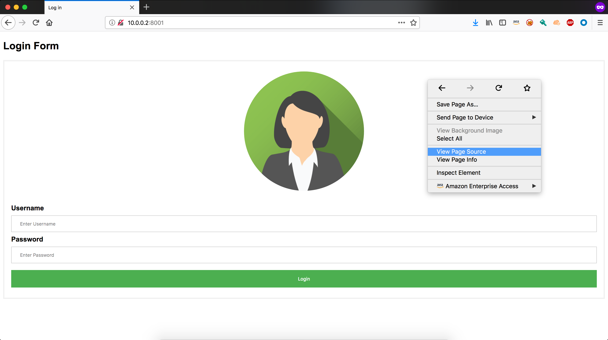
 
Scrolling down a little, you will be able to see a _login_ function with its credentials hardcoded.

Now simply insert those credentials on the page form.

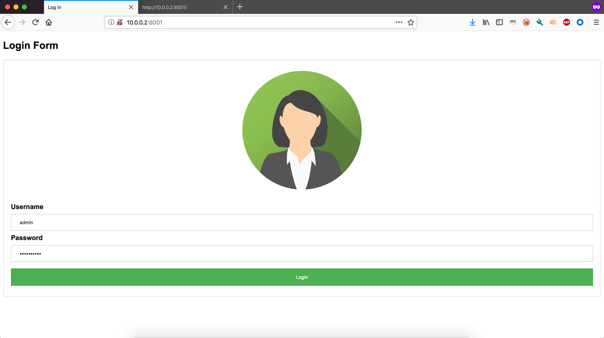

That's it! That solves level 1.

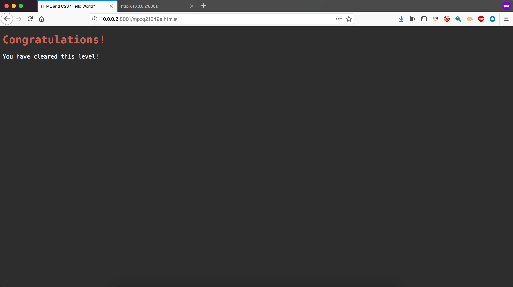

## Level 2

Like in the previous level, visit the 10.0.0.2:8002 page and inspect its code. 

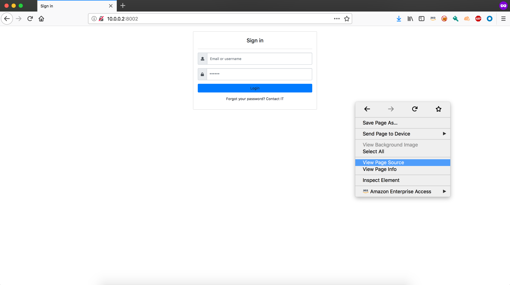

This time, you will notice a _try_login_ function that performs some request on a backend server.

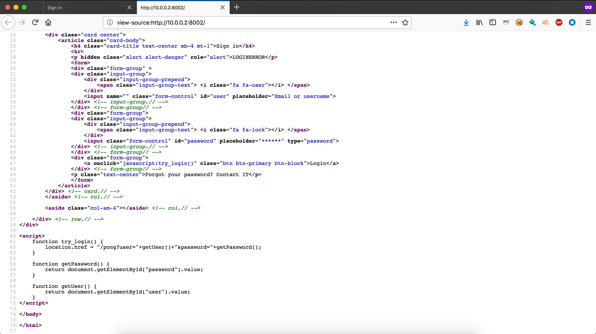

Since the form has no validation, an injection attack can be attempted. Considering an SQL query of the format _SELECT * FROM users WHERE..._ filling any form field with something like _a' or true; --_ will always fetch a result.

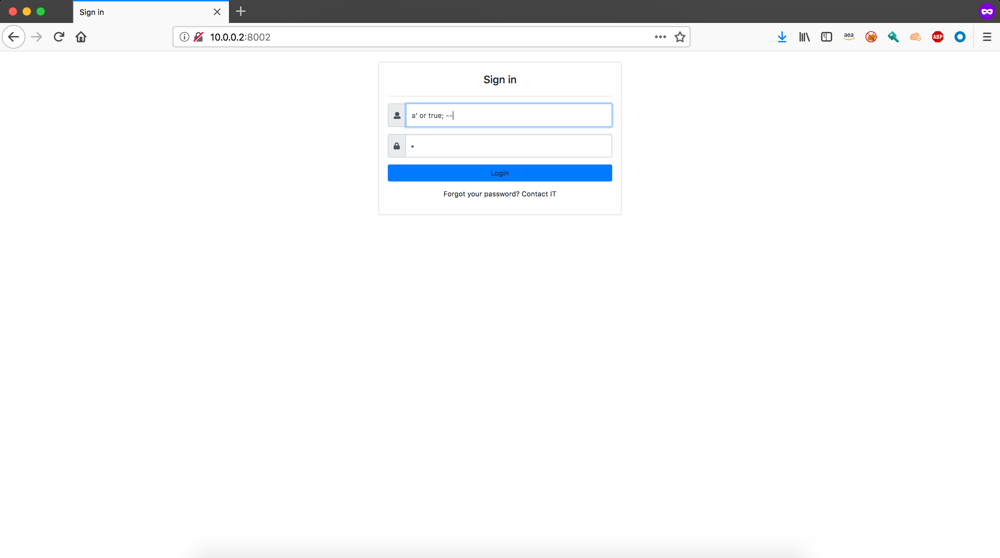

Now, when trying the login, you will see it succedes and the level is thus cleared.

## Level 3

This time, when typing _play-level-3_ the following encrypted message shows up.

Such message can be easily decrypted with any Vigenère solver. For instance, by typing _Vigenère solver online_ on Google you can land at the following page.

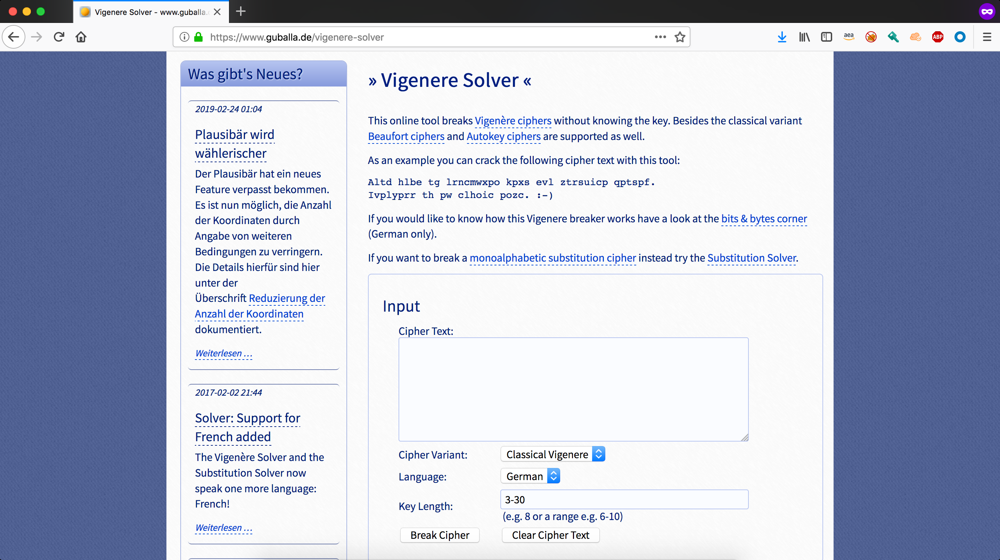

Pasting the message and choosing _English_ as language you can now easily decrypt it.

## Level 4

Visit the web page on 10.0.0.2:8004 and view the page source code.

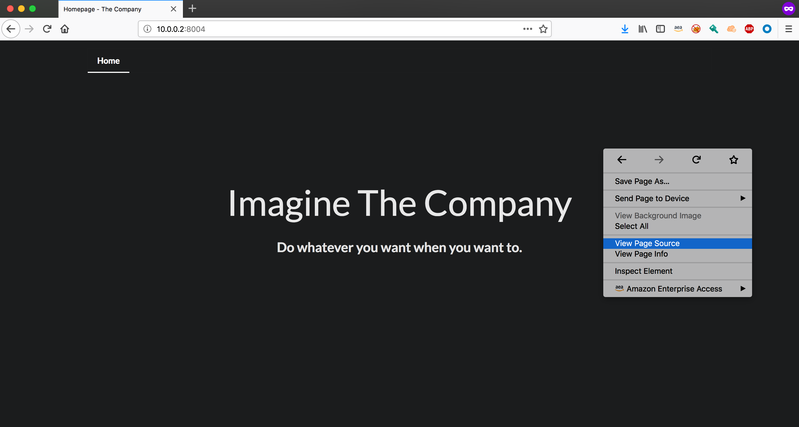

On the source code, you will notice some HTML _href_ fields with a local reference. 

By clicking any of the files, you will be able to inspect it.

Notice how the URL of your browser changes to point at the chosen file. By changing such URL you can inspect the servers directory. For instance, by navigating to the _dist_ folder.

That way, by exploring a little you can find the _secrets_ file on the _/dist/components_ directory of the server.

By opening it, you can find a message telling you the level has been cleared.

## Level 5

Visiting 10.0.0.2:8005 you will find some phpLDAPadmin login page for a user _David Benioff_.

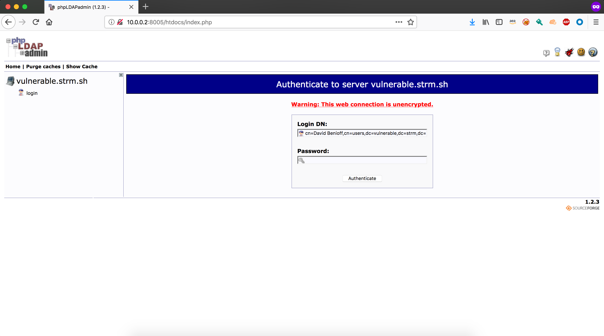

The key here is the admin panel used: phpLDAPadmin has some cache vulnerability described on [this link](https://pastebin.com/raw/Rf002LdV).

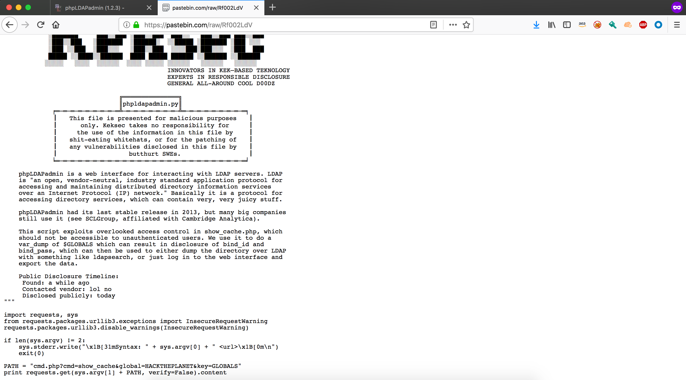

Since the user _David Benioff_ was already on the login page, the cache vulnerability exploit can be considered. By executing the script provided on the post and dumping its output to a file, it is posibble to search for and find our friend David.

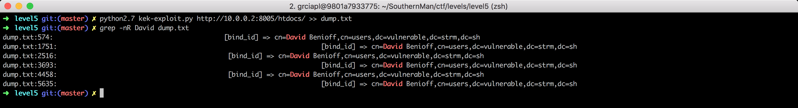

By inspecting the lines surrounding the match, you will see an LDAP bind pass has been leaked.

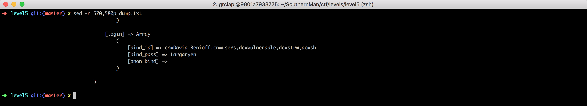

After inserting the LDAP pass on phpLDAPadmin login page, the level is finished and a congratulations message appears on the screen.

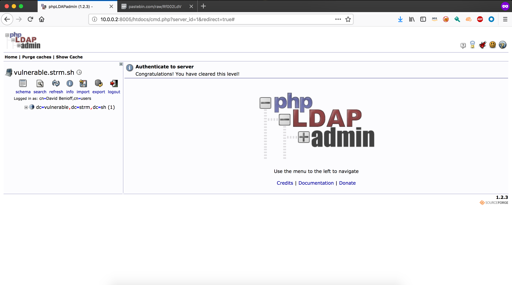

## Level 6

After exploring the page on 10.0.0.2:8006 a little, you will be able to confirm that a user can see the latest reviews. What is more, by carefully looking at the last of them, you will notice that they can contain HTML tags (evidenced by the italic _love_ word).

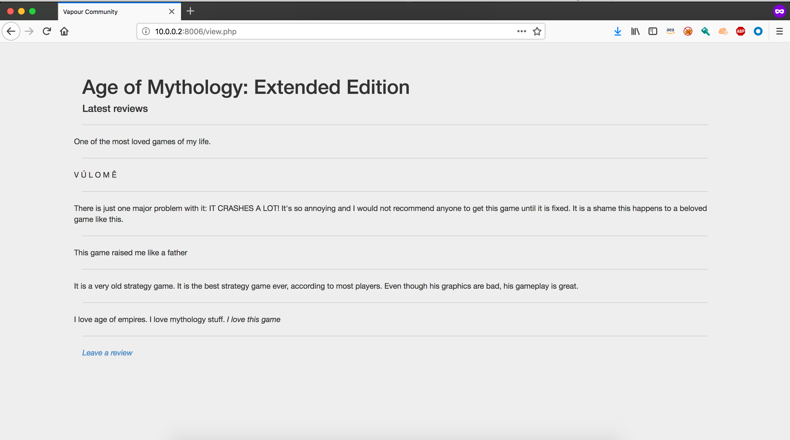

That way, an XSS attack can be attempted. Since the goal is to steal the website users' cookies, you should try to redirect them into an IP under your control (the one at your machine). Additionally, you should force the redirect in a way that would allow you to recover the cookies (for instance, using the cookies values as an endpoint).

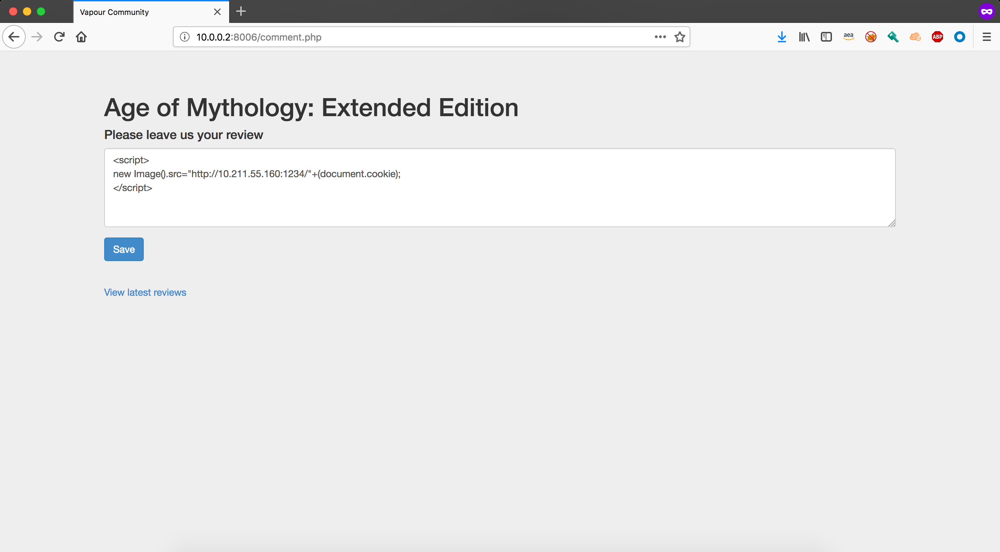

A fast and simple way to test the XSS is with the _nc_ command. By listening on your machine IP and waiting a little for your victim, you will eventually see a request confirming you have cleared the level.

## Level 7

When visiting the level page at 10.0.0.2:8007 you will be able to see the following.

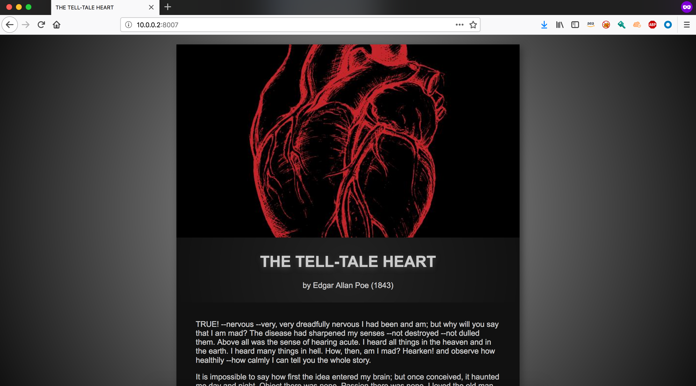

In an ironic manner, the same web page is telling you to exploit the Heartbleed vulnerability of OpenSSL. An easy way to do that is with the metasploit console, which can be used out of the box with Docker.

Once the container is up, enter the _msfconsole_ command. On the metasploit console, use the OpenSSL Heartbleed auxiliary scanner setting the _rhosts_ parametar to 10.0.0.2 and the _verbose_ to true.

After running the _exploit_ command, you will be able to see a small memory dump of the server. Inspecting that dump you will be able to find the server's private key and the classic congratulations message.

## Level 8

Since the only content on this level web page are a huge image and a weird quote, just save the Inception image on your computer.

As the message you are looking for seems to be hidden _inside_ the image, search for some steganography tools to use. For instance, open StegOnline on your browser.

By clicking on _upload image_ you will be able to start inspecting the downloaded picture.

Click then on the _Browse Bit Planes_ option. You will be able to see the hidden message hidden on the lowest bit plane of the image.

